# Hip Hop Foundation Platform

A full-stack content management platform designed for a real-world non-profit organization, enabling administrators to manage digital content, media, and user communication through a secure dashboard.

## 🌍 Live Demo

🔗 https://hiphop-foundation-platform.vercel.app/

📂 Source Code:
https://github.com/Tmkandawire/hiphop-foundation-platform

## 📸 Preview

### Public Homepage

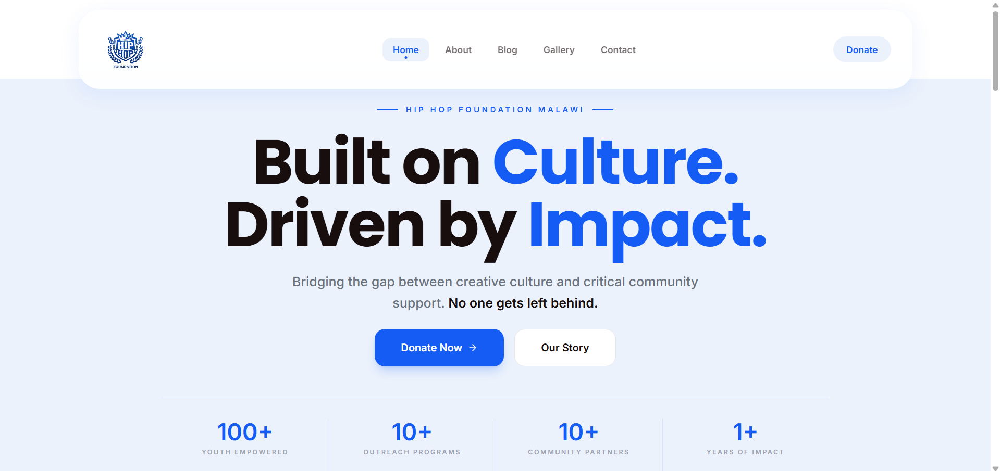

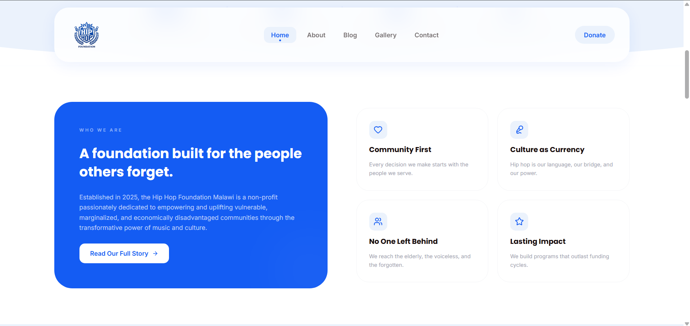

### Public Blogpage

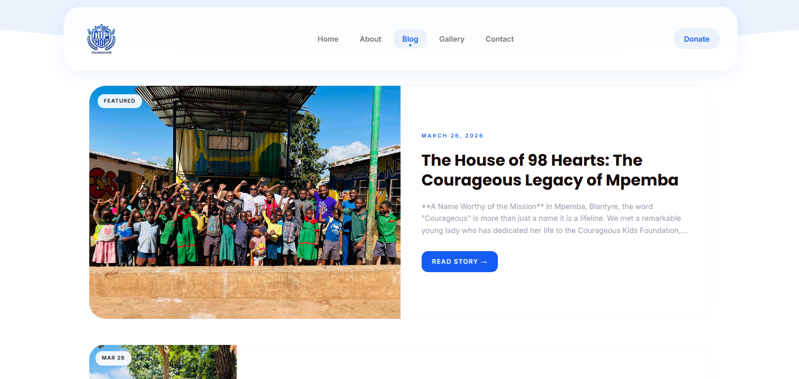

### Public Contactpage

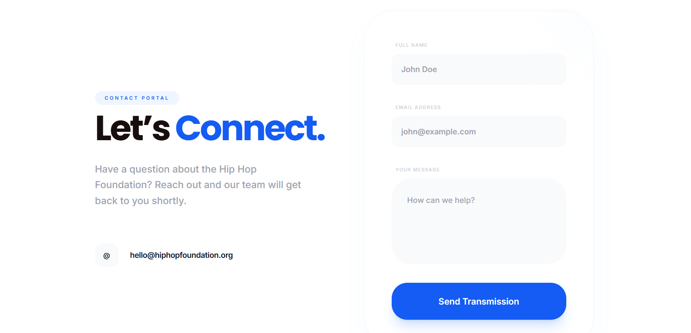

### Public Mobile view

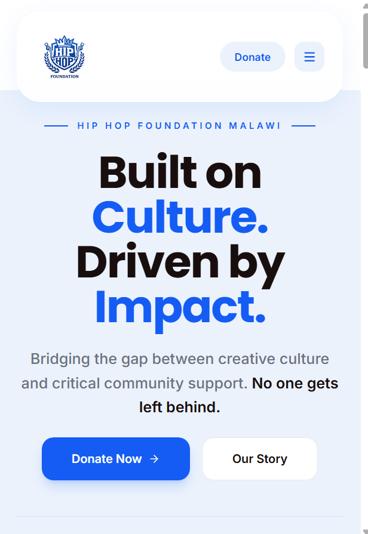

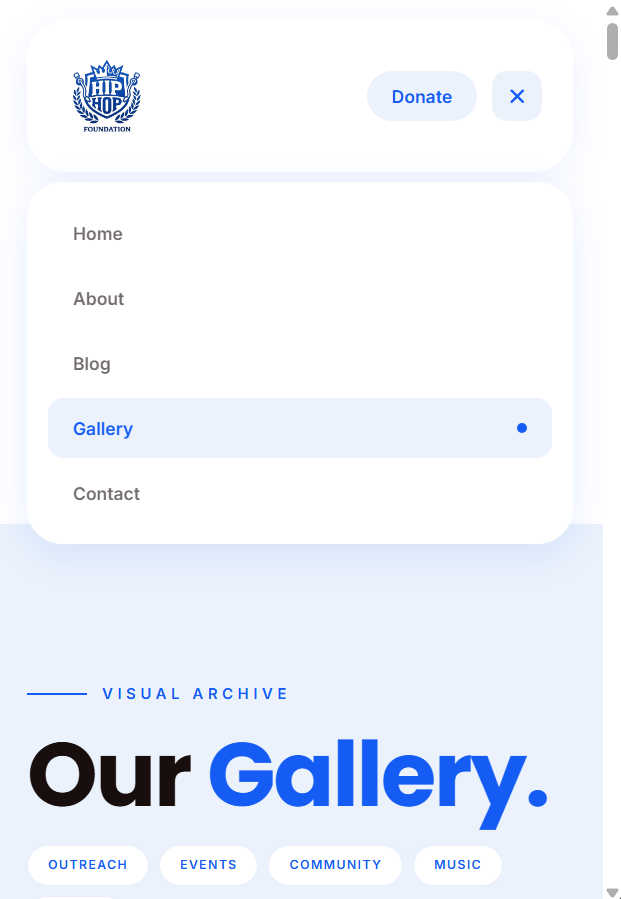

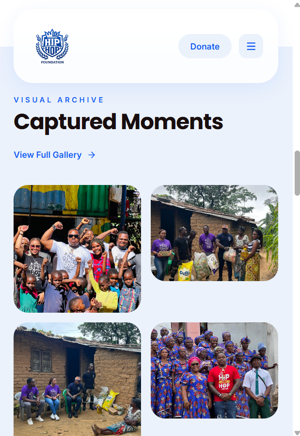

### Admin login

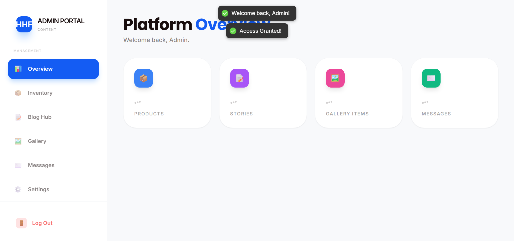

### Admin Dashboard

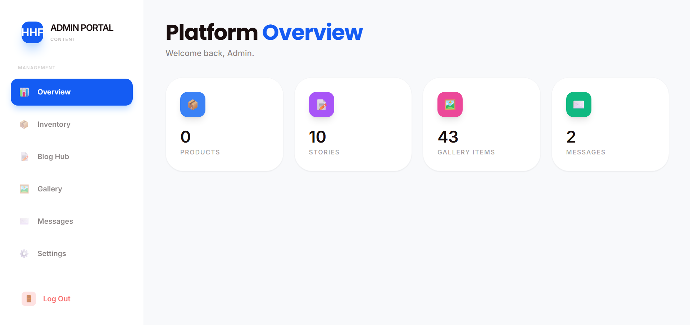

### Blog Management

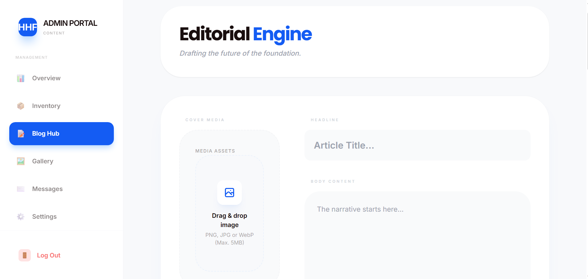

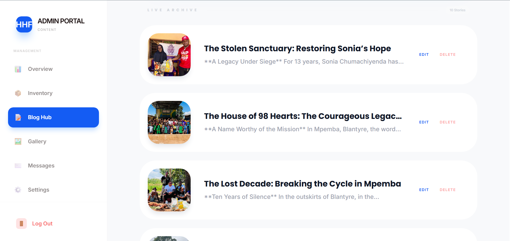

### Gallery Management

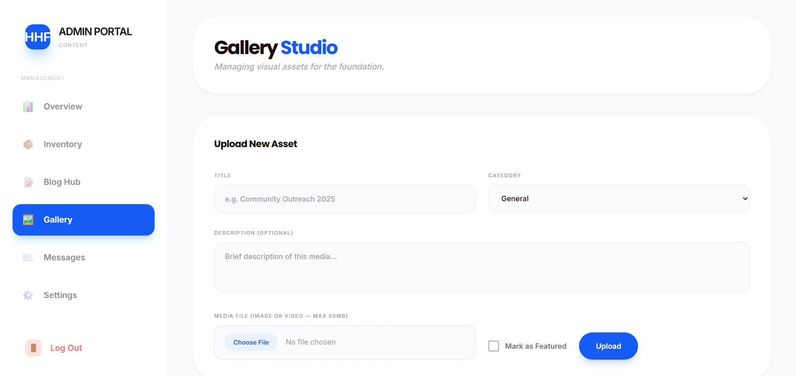

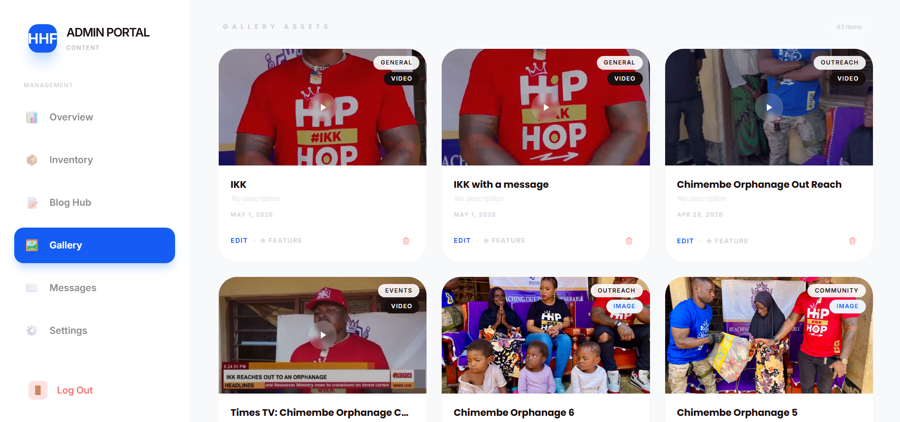

### Message Center

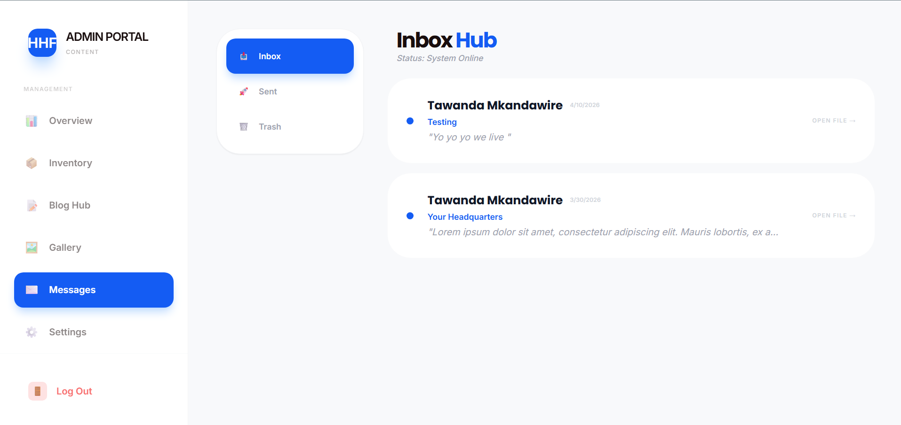

### Admin Settings

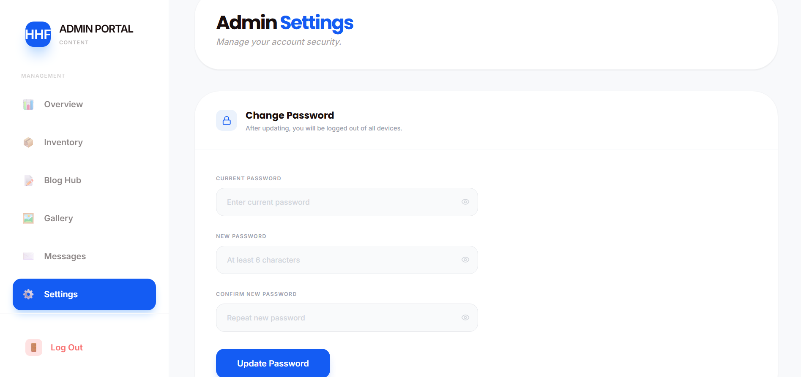

### Admin logout

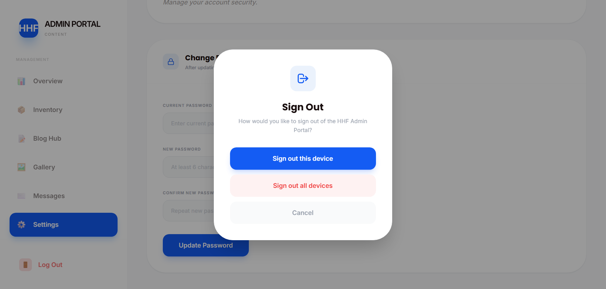

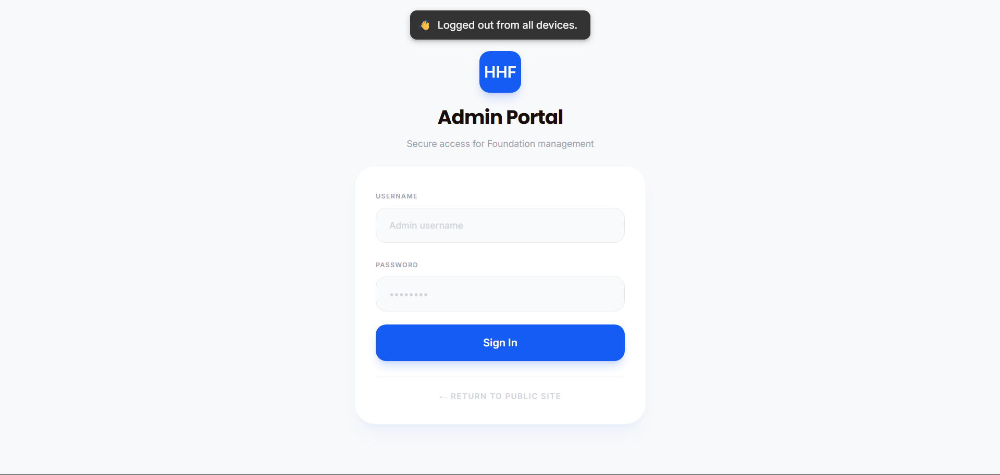

## 📌 Overview

This project was built for a real organization to digitize content management and reduce dependency on manual website updates.

The platform enables administrators to:

- Manage blog content
- Upload gallery media
- Handle contact inquiries
- Maintain organizational visibility online

## 📊 Project Highlights

- Secure Admin Dashboard
- JWT Authentication
- Dynamic Blog Management
- Dynamic Gallery Management
- Contact Message Handling
- Responsive Mobile Design
- Production Deployment  

## 🚨 Problem Statement

Many small organizations rely on static websites or manual workflows to manage their digital presence.

This creates several operational challenges:

- Slow content updates
- Dependency on technical personnel
- Poor communication management
- Lack of centralized administration

## 💡 Solution

I designed and built a full-stack platform that provides a centralized admin dashboard for content management, communication handling, and operational administration.

The system allows non-technical users to manage website content securely through a modern web interface.

## 📈 Business Impact

The platform enables the organization to:

- Update website content without developer assistance
- Publish stories and announcements in real time
- Manage community engagement through contact inquiries
- Maintain a professional online presence
- Reduce dependency on manual website updates

## 🚀 Features

### 🔐 Authentication & Authorization
- Secure admin login
- JWT authentication
- Protected admin routes

### 📝 Content Management
- Create, edit, and delete blog posts
- Dynamic gallery management

### 📬 Message Handling
- Contact form integration
- Backend message processing

### 🌐 Public Website
- Responsive UI
- Dynamic content rendering

## 🏗 Architecture

The application follows a layered full-stack architecture:

Client → API → Business Logic → Database

### System Architecture

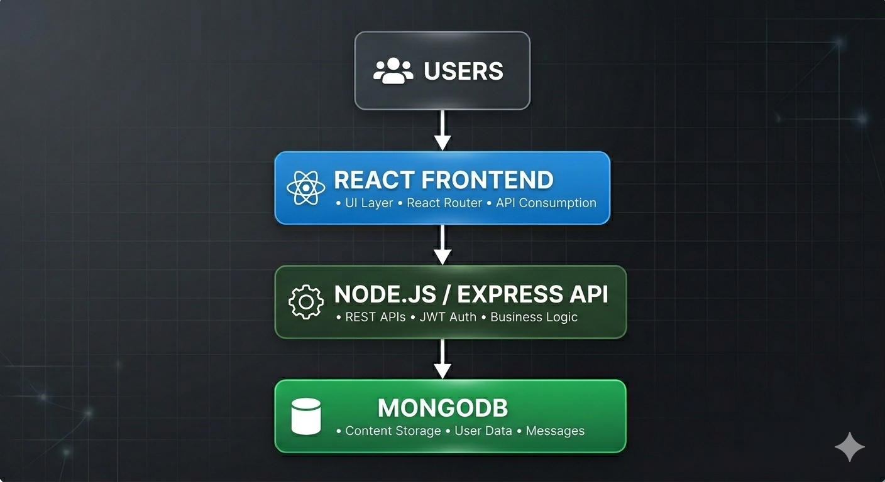

### Backend Flow

Routes → Controllers → Services → Database

## 🛠 Tech Stack

### Frontend
- React
- TailwindCSS / DaisyUI

### Backend
- Node.js
- Express.js

### Database
- MongoDB

### Deployment
- Vercel
- Render

## 🧠 System Design

The platform was designed with scalability and maintainability in mind.

Key design decisions included:

- Separation of frontend and backend concerns
- Modular backend architecture
- Dynamic content rendering
- Secure authentication workflows

## 🔐 Security & Hardening

Security measures implemented include:

- JWT authentication
- Password hashing
- Protected API routes
- Environment variable management
- Input validation
- Secure deployment practices

## 📂 Project Structure

project-root/

frontend/
backend/
docs/
screenshots/
README.md

## ⚙️ Installation

### Clone Repository

git clone https://github.com/Tmkandawire/hiphop-foundation-platform.git

cd backend
npm install
npm run dev

cd frontend
npm install
npm start

## 🔑 Environment Variables

Create a `.env` file in the backend directory:

env
MONGO_URI=
JWT_SECRET=
PORT=

## 🚀 Deployment

Frontend deployed on Vercel.

Backend hosted separately on Render with environment-based configuration for production deployment.

## 🎥 Demo Videos

### Admin Dashboard Walkthrough
[Watch Demo](your-video-link)

### Content Management Demo
[Watch Demo](your-video-link)

## ⚡ Engineering Challenges

### Authentication Security

Implementing secure JWT-based authentication while ensuring protected access to administrative routes.

### Dynamic Content Management

Designing a flexible content management workflow that allows non-technical users to update website content without developer involvement.

### Production Deployment

Managing environment-specific configurations and secure deployment practices across frontend and backend services.

## 🧠 Lessons Learned

This project strengthened my understanding of:

- Full-stack application architecture
- Authentication and authorization
- Backend API design
- Deployment and production hardening
- Real-world client requirements

## 🚧 Future Enhancements

- Role-Based Access Control (RBAC)
- Activity Audit Logging
- Analytics Dashboard
- Cloud Media Storage
- CI/CD Automation Pipeline

## 👨‍💻 Author

Tawanda Mkandawire

Backend Engineer | System Design | Building Scalable Digital Systems
