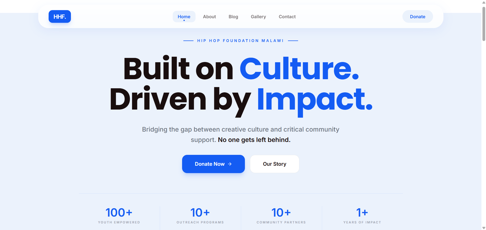

# Hip Hop Foundation Platform

A full-stack content management platform designed for a real-world non-profit organization, enabling administrators to manage digital content, media, and user communication through a secure dashboard.

## 🌍 Live Demo

🔗 https://hiphop-foundation-platform.vercel.app/

## 📸 Preview

### Public Homepage

## 📌 Overview

This project was built for a real organization to digitize content management and reduce dependency on manual website updates.

The platform enables administrators to:

- Manage blog content
- Upload gallery media
- Handle contact inquiries
- Maintain organizational visibility online

## 🚨 Problem Statement

Many small organizations rely on static websites or manual workflows to manage their digital presence.

This creates several operational challenges:

- Slow content updates
- Dependency on technical personnel
- Poor communication management
- Lack of centralized administration

## 💡 Solution

I designed and built a full-stack platform that provides a centralized admin dashboard for content management, communication handling, and operational administration.

The system allows non-technical users to manage website content securely through a modern web interface.

## 🚀 Features

### 🔐 Authentication & Authorization
- Secure admin login
- JWT authentication
- Protected admin routes

### 📝 Content Management
- Create, edit, and delete blog posts
- Dynamic gallery management

### 📬 Message Handling
- Contact form integration
- Backend message processing

### 🌐 Public Website
- Responsive UI
- Dynamic content rendering

## 🏗 Architecture

The application follows a layered full-stack architecture:

Client → API → Business Logic → Database

### Backend Flow

Routes → Controllers → Services → Database

## 🛠 Tech Stack

### Frontend
- React
- TailwindCSS / DaisyUI

### Backend
- Node.js
- Express.js

### Database
- MongoDB

### Deployment
- Vercel
- Render

## 🧠 System Design

The platform was designed with scalability and maintainability in mind.

Key design decisions included:

- Separation of frontend and backend concerns
- Modular backend architecture
- Dynamic content rendering
- Secure authentication workflows

## 🔐 Security & Hardening

Security measures implemented include:

- JWT authentication
- Password hashing
- Protected API routes
- Environment variable management
- Input validation
- Secure deployment practices

## 📂 Project Structure

project-root/

frontend/
backend/
docs/
screenshots/
README.md

